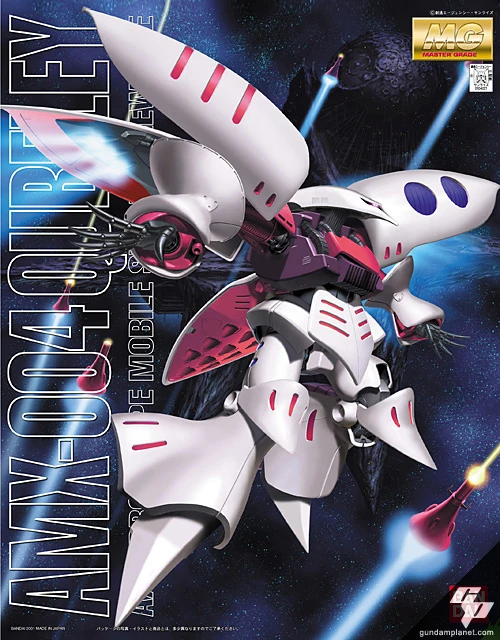

# MG Kits

These are 1/100 Master Grade line of Gunpla kits. MG line started in 1995 and it's still ongoing.

## Regular Release:  

### Hyaku Shiki 2.0

### Machine:

### Boxart:

### Sazabi Ver. Ka

### Machine:

### Boxart:

### Full Armor Unicorn Gundam

### Machine:

### Boxart:

### Gundam GP02A

### Machine:

### Boxart:

### Psycho Zaku Ver. Ka

### Machine:

### Boxart:

### ZZ Gundam Ver. Ka

### Machine:

### Boxart:

### Gundam Ez8

### Machine:

### Boxart:

### Qubeley

### Machine:

### Boxart:

### Gundam F91 2.0

### Machine:

### Boxart:

### Crossbone Gundam X-1 Ver. Ka

### Machine:

### Boxart:

### Char's Z'Gok Commander Type 

### Machine:

### Boxart:

### Qubeley Mk-II

### Machine:

### Boxart:

## P-Bandai:

### Banshee Norn

### Machine:

### Boxart:

